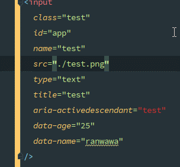
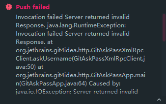
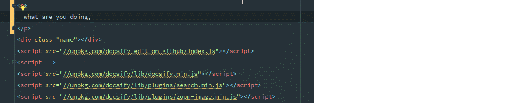

## 1. [已解决]报错: ESLint: TypeError: this.cliEngine is not a constructor(190825)

**业务背景**

更新了package.json里面的elint版本,重新下载了依赖包后,IDE就报这个错

**问题解决**

升级`webstorm`到最新版本,或者把eslint降级到5.x版本

**原因分析**

就是ide和eslint版本不兼容导致的

## 2. [已解决]静态页面实时预览

**业务背景**

经常会单独开发两个单独的静态网页,改了东西还要手动去刷新,简单不要太麻烦,所以想要像`vue`那样改变内容后自动刷新的功能

但是我每次直接点编辑器

**问题解决**

IDE自带了`live edit`功能,配合`debug`和`chorme`插件即可完成

具体的设置方法参考: https://www.jetbrains.com/help/webstorm/live-editing.html

**踩中的坑**
- `chomre`上安装了`JetBrains IDE Support`插件,但还是没效果
  - 点右键看看是否能够获取网页数据,不行的话重新安装就好了
- 点`debug`蜘蛛,打开的是一个空网页,根本用不了,而点编辑器右上角的浏览器图标,又没办法激活`chorme`插件
  - 先点绿色的三角形启动调试,再点红色的蜘蛛启动debug,蛛蛛右上角出现绿点后就ok了

## 3. setting repository无法同步github上的配置文件

**业务背景**

新电脑，新安装了`WebStorm 2019.2.1`版本，File -> settings reponsitory -> 粘贴github仓库地址 -> 填写token -> overwrite local -> 右下角提示 settings successfully xynced

但实际上我的快捷键都没变

尝试了重装软件，重启电脑都无效。确定仓库上的快捷键是有效的。

之前也遇到过这个问题，但是不知道怎么的就出来了，所以就没做笔记，今天[2019-09-06]搞了一个多小时还是没出来。

## 4. vue文件里面的style,在格式化时不能自动排序规则顺序

**业务背景**

一直以来,都是手动调整CSS规则的属性,但是一些比较少用的属性顺序都是乱排的,比如动画,栅格的子属性及一些新的属性.自己去按照一些标准的规范把所有的顺序都记下来吧,也不现实,所以就利用IDE本身的`arrangement`自动格式化.这个确实很好用,在`HTML`和`CSS`文件都都能很好工作,但是在`VUE`里面就不生效了

## 5. [已解决]WebStorm中push远程代码的时候,总是报权限错误(191108)

**业务背景**

通过`WebStorm`自带的Git工具push代码的时候,就总是报这个错,也不提供修改帐号密码的弹框,用命令行直接提交,就会提示输入帐号密码,但是输入后不会自动保存

**问题解决**
- 设置面板 -> Appearance && System Settings -> Password 关掉保存密码
- 关掉IDE,重新进入
- 重新Push,输入密码并且保存
- 然后再去设置面板打开即可
- 参考: https://stackoverflow.com/questions/28142361/change-remote-repository-credentials-authentication-on-intellij-idea-14

## 6. 代码格式化时,中文无法自动换行
**业务背景**

在系统自带的代码格式化配置的HTML里面设置了单行最大宽度,并且输入时会自动换行.但是中文里面无法生效,感觉这个问题和css里面的换行逻辑一样

