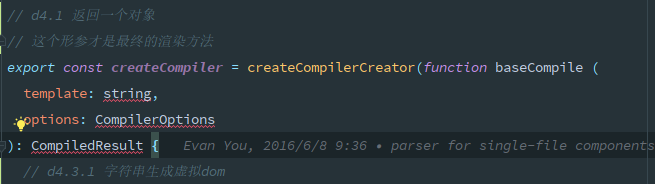

## 1. [已解决]报错: ESLint: TypeError: this.cliEngine is not a constructor(190825)

**业务背景**

更新了package.json里面的elint版本,重新下载了依赖包后,IDE就报这个错

**问题解决**

升级`webstorm`到最新版本,或者把eslint降级到5.x版本

**原因分析**

就是ide和eslint版本不兼容导致的

## 2. [已解决]静态页面实时预览

**业务背景**

经常会单独开发两个单独的静态网页,改了东西还要手动去刷新,简单不要太麻烦,所以想要像`vue`那样改变内容后自动刷新的功能

但是我每次直接点编辑器

**问题解决**

IDE自带了`live edit`功能,配合`debug`和`chorme`插件即可完成

具体的设置方法参考: https://www.jetbrains.com/help/webstorm/live-editing.html

**踩中的坑**
- `chomre`上安装了`JetBrains IDE Support`插件,但还是没效果
  - 点右键看看是否能够获取网页数据,不行的话重新安装就好了
- 点`debug`蜘蛛,打开的是一个空网页,根本用不了,而点编辑器右上角的浏览器图标,又没办法激活`chorme`插件
  - 先点绿色的三角形启动调试,再点红色的蜘蛛启动debug,蛛蛛右上角出现绿点后就ok了


## 3. setting repository无法同步github上的配置文件

**业务背景**

新电脑，新安装了`WebStorm 2019.2.1`版本，File -> settings reponsitory -> 粘贴github仓库地址 -> 填写token -> overwrite local -> 右下角提示 settings successfully xynced

但实际上我的快捷键都没变

尝试了重装软件，重启电脑都无效。确定仓库上的快捷键是有效的。

之前也遇到过这个问题，但是不知道怎么的就出来了，所以就没做笔记，今天[2019-09-06]搞了一个多小时还是没出来。

## 4. vue文件里面的style,在格式化时不能自动排序规则顺序

**业务背景**

一直以来,都是手动调整CSS规则的属性,但是一些比较少用的属性顺序都是乱排的,比如动画,栅格的子属性及一些新的属性.自己去按照一些标准的规范把所有的顺序都记下来吧,也不现实,所以就利用IDE本身的`arrangement`自动格式化.这个确实很好用,在`HTML`和`CSS`文件都都能很好工作,但是在`VUE`里面就不生效了


## 5. [已解决]WebStorm中push远程代码的时候,总是报权限错误(191108)

**业务背景**

通过`WebStorm`自带的Git工具push代码的时候,就总是报这个错,也不提供修改帐号密码的弹框,用命令行直接提交,就会提示输入帐号密码,但是输入后不会自动保存


**问题解决**
- 设置面板 -> Appearance && System Settings -> Password 关掉保存密码
- 关掉IDE,重新进入
- 重新Push,输入密码并且保存
- 然后再去设置面板打开即可
- 参考: https://stackoverflow.com/questions/28142361/change-remote-repository-credentials-authentication-on-intellij-idea-14


## 6. 代码格式化时,中文无法自动换行
**业务背景**

在系统自带的代码格式化配置的HTML里面设置了单行最大宽度,并且输入时会自动换行.但是中文里面无法生效,感觉这个问题和css里面的换行逻辑一样


## 7. [已解决]查看代码时,历史纪录切换的快捷键是啥(191118)

**业务背景**

在查看别人源码的时候,总是会一直不停的`ctrl +
F12`追踪代码的执行步骤,但是代码层次稍微深一点的话,有时候想要返回查看刚刚查看的那几个方法,就比较麻烦了,要么是从头来,这样又要重复一次操作.要么是手动点开某个标签定位到代码位置,可是别人的代码是不熟悉的,这样操作也是有难度.o
记得有一个快捷键,可以像浏览器的历史纪录那样,前进后退,可以完美解决这个问题

**问题解决**
- 这个在WebStorm里面叫做最近定位纪录
- 可能通过`ctrl + shift +
  e`查看所有最近定位过光标的纪录,类似于查看浏览器的所有历史纪录
- 或者通过`ctrl + alt + <-/->`来快速切换,类似于浏览器里面的前进/后退
- [参考]
  (https://www.jetbrains.com/help/webstorm/2019.2/navigating-through-the-source-code.html)


## 8. [已解决]支持`flow`语法检查(191119)

**业务背景**

最近开始学习`vue`源码,它使用的是`flow`类型检查,老是报错,好烦~~插件里面搜索了一下flow,也没相关的可用插件



**问题解决**
- Settings -> Languages & Frameworks -> version -> flow
- 保存即可
- [参考](https://blog.jetbrains.com/webstorm/2016/11/using-flow-in-webstorm/)

## 9. .vue文件里面在HTML节点上使用$event有警告(191121)

**业务背景**

在vue的子组件里面触发父组件的一个事件,为了省代码,以便后期阅读,所以直接写在了HTML里面,可是这样的话`$event`变量会报警告,想着去inspections里面把这条规则关掉,但是官方推荐添加框架的全局变量,看了一下,要自己写*.ts类型声明文件,留着以后再搞吧


## 10. [已解决]npm scripts tool不见了(191126)

**业务背景**

最开始运行npm命令是打开一个git窗口,在里面手动输入命令,后来切换到IDE内部打开terminal面板手`动输入命令,最近要联调uni-app的网页+各种小程序,所以用上了内置的scripts tool,点几下就行了,不用打开几个terminal窗口输入几次命令,可是前几天在调整IDE界面的时候,不知道咋的就把它搞不见了

在设置里面找了好久找到设置的地方

**问题解决**
- 打开package.json文件
- 点右键 -> show npm scripts

## 11. [已解决]在sass变量/混合的智能提示里面显示对应的注释(191128)

**业务背景**

自定义了sass公共库,所有项目都引用这个公共库,但是有好多变量记不住具体是什么意思,并且是什么值,特别是字号和间距那几个变量.每次写的时候都要跳到对应的sass页面看看,我要14号大小的字体,应该用哪个变量.再回来写,相当麻烦.就想着在智能提示的时候,能不能把值或者对应的注释顺便给显示出来,就不用我去跳页面了

_size.scss
```sass
// 内容小板块间距 10
$section-xs: px2vw(10);
// 特殊版块和标题版块间距 12
$section-sm: px2vw(12);
// 主容器水平方向padding
$section-md: px2vw(16);
// 内容大板块间距 24
$section-lg: 24;
```

**问题解决**
- 自动打开
  - settings -> code -> general -> code completion
  - 选中`show the documentation popup in 1000 ms
  - 把时间改成100
  


- 手动打开
  - 输入变量`$sec`,智能提示就会出来
  - 按下`ctrl + q` 和 `ctrl + shift + i`即可打开注释和定义窗口
  
## 12. [已解决]快捷键切换工作区组(191128)

**业务背景**

开发的时候经常是分成2屏甚至是3屏同时操作,一边显示HTML,一边显示JS,一边显示CSS,这样搞起来快,在同一个工作组里面可以通过快捷键快速切换editor,但是不同的组之间,现在还是通过鼠标来点.写代码的时候,写着写着,要去碰一下鼠标,是真心有点烦.

**问题解决**
- settings -> keymap -> main menu -> window -> editor tabs
- 找到`go to next/previous spliter`
- 设置相应的快捷键即可


## 13. [已解决]如何给webstorm添加全局变量(20200108)

**业务背景**

昨天开始写给`.vue`组件写单元测试,新建了`*.spec.js`文件,里面使用describe和it等关键词的时候都会有黄色的警告,原因是无法识别这种全局变量.感觉这个和第9个问题是一模一样的


**问题解决**
- 安装一个第三方库到WebStorm里面,然后设置为全局有效就行了
- Settings -> Language & Frameworks -> JavaScript -> Libraries -> Download -> 选择jest就行
- 参考
  - https://www.jetbrains.com/help/webstorm/configuring-javascript-libraries.html?q=webpack%20alias
  
## 14. [已解决]如何关联webpack别名@(20200108)

**业务背景**

使用vue-cli3/4生成的项目,因为通过服务端插件把webpack配置给隐藏到底层了,所以WebStorm无法识别webpack里面的别名.有时候写相对路径又太长了,看着不爽,但是换成别名`@`后,又会有波浪线提示,并且无法快速跳转到对应的文件里面


**问题解决**
- 还是和vue-cli2一样,得自己在根目录下面再单独配置一个webpack配置文件,一般重启IDE就好了
- 如果不生效,就手动然后把把webpack设置指向这个文件就行了
- 参考
  - https://www.jetbrains.com/help/webstorm/using-webpack.html

```
// webpack.config.js配置
const path = require('path');
module.exports = {
  resolve: {
    alias: {
      '@': path.resolve(__dirname, 'src/'),
    },
  },
};
```


