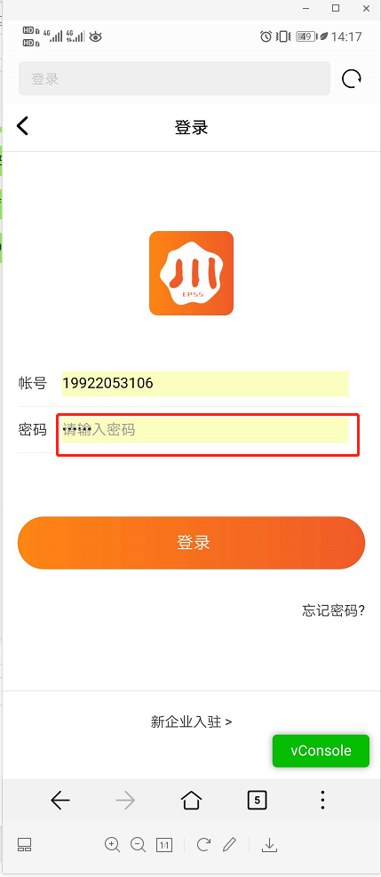

### 1. [已解决]`a`标称`href`值为`javascript:void(0)`的原理(20200212)

**业务背景**

最近又在写静态页面,链接要暂时做个占位,要可以点击,但也别跳转.一直都知道有两种方案
- ####
- javascript:void(0)

之前查过`####`的原理,现在忘记了,javascript这个好像和html里面可以执行javascript代码相关,但也无法详细说出来,干脆趁这个机会就整理一下

**问题解决**
- 20200212
- javascipt:void(0)
  - html嵌入javascript代码有4种方式,其中一种就是通过链接javascript协议.所以这里的javascript:是一个协议
  - void是一个运算符,用于返回undefined.所以这里的void(0)可以换成其他任何表达式比如void(1)或`;`
  - 参考
    - https://ranwawa.github.io/document/#/study/JavaScript%E6%9D%83%E5%A8%81%E6%8C%87%E5%8D%97/%E7%AC%AC13%E7%AB%A0_%E5%AE%A2%E6%88%B7%E7%AB%AFJavaScript?id=_132-%e5%9c%a8html%e9%87%8c%e5%b5%8c%e5%85%a5javascript
    - https://developer.mozilla.org/zh-CN/docs/Web/JavaScript/Reference/Operators/void
- ####
  - \#后面的是页面标记
  - 浏览器会自动滚动到该标记
  - 如果是一个无意义的标记的话,就不会进行滚动,所以这个###可以换成其他任何值比如#xxxxx,前提是target属性必须是_self
  - 参考
    - https://html.spec.whatwg.org/multipage/browsing-the-web.html#scroll-to-fragid


### 2. [已解决]字体大小导致IDE中的换行会导致最终生成的页面超出固定宽度(20200212)

**业务背景**

在编写固定宽度的HTML代码时,一个父元素宽1200px,3个子元素分别是400px,明明刚刚好,但在网页上却要换行,其原因就是父元素字体大小,而换行符在html里面被解析成了空白,空白在固定字体大小下就有了一定宽度,最终导致换行

现在的解决方案是把父元素的字号设置成0,由于字号是要继承的,所以再挨个把子元素的字号设置回去,但是总这样搞太麻烦了,肯定有更简单的方法

**示例代码**

```html
  <style type="text/css">
    .outer {
      width: 1200px;
    }
    .inner {
      display: inline-block;
      width: 400px;
      outline: 1px solid red;
    }
  </style>
<div class="outer">
  <div class="inner">1</div>
  <div class="inner">2</div>
  <div class="inner">3</div>
</div>
```

**问题解决**
- 20200212
- 子元素全部float起来就行了
- 或者代码输出的时候,通过压缩工具,删除所有的换行符,但这个在静态页面调试的时候需要引入压缩工具有点麻烦了,以后有需要了再研究吧


### 3. 如何去掉浏览器input自动保存帐号密码导致的内置样式?(20200317)

**业务背景**

之前写管理后台的登陆页面时遇到这个问题,自动保存密码后,input框会有黄色背景勾搭. 但仅限于内部人员使用,所以未太在意.

这次在移动端上面向用户做了一个登陆界面,还是出现这个问题.并且密码框更夸张,除了黄色背景外,placeholder和密文同时存在.就必须得解决啦.



**问题解决**


### 4. [已解决]img.srcset到底有什么用?(20200515)

**业务背景**

昨天在看一个无限滚动的插件文档,里面提到了srcset,之前也在一些地方看到过,大概记得和响应式图片有关,但具体怎么个有关法,怎么用还是不太了解.况且,现在通过对象存储,直接在cdn图片链接后面加上一个参数,就可以完美实现响应式图片了,那用这个属性还有啥用呢

今天就仔仔细细的把MDN上的文档过了一遍.

**问题解决**
- 20200515
- 有两种配置方式
  - srcset="exa@1.png 1x, exa@2.png 2x, exa@3.png 3x"
    - 是在不同的设备像素比下显示不同的图片,以节省流量和提升图片显示质量
    - 首先获取设备的设备像素比
    - 1x,2x,3x...就是指不同的设备像素比,选择显示对应的图片
    - 如果是电脑屏幕,则设备像素是1x
    - 1x对应的图片是exa@1.png,所以显示它
  - srcset="small.png 375w, largepng 1024w" sizes="(max-width: 414px) 400px, (min-width: 1024px) 1000px"
    - 首先是根据sizes来设置图片槽的宽度,即414px以下屏幕图片槽为400px
    - 然后再根据srcset里面的w最近的值来选择显示的图片
    - 如果是苹果6,viewport是375,则图片槽为400
    - 离400最近的srcset中的w值是375w
    - 所以显示是small.png
- 和对象存储自定义参数的方案对比
  - srcset属于静态页面,由浏览器自动来选择,所以对seo友好
  - 对象存储那个需要js来动态设置图片链接,所以要自己计算,并且只适用于spa应用

难得去写示例实现了....

### 5. [已解决]fieldset和legend标签有什么具体作用呢?(20201008)

**业务背景**

昨天在学习react-router的时候,示例代码里面看到这两个html标签.才发现好多HTML5的新标签都不熟悉哇.so
,看到一个,了解一个,搞定一个.并且要改掉之前的毛病,因为怕麻烦,而不写示例代码.

**问题解决(20201008)**

fieldset是什么
 - fieldset控件组
 - 正如其名,是用来把一类表单控制归为一组的
 
fieldset有什么用
 - 语义化,同类别的表单放在一个fieldset里面
 - 便于管理,通过disable或form属性,可以为其下面的所有表单控制统一设置相关属性
 - 例如,注册微信公众号,需要提交公司信息,app信息,个人信息,而这些信息就可以分为3个fieldset来进行管理

legend是什么
 - legend说明
 - 必须和fieldset一起出现,就像ul li一样
 - 就是当前表单组的说明文字
 
 **示例代码**

jsfiddle被墙了,要10块钱才能过去,忍一下吧.... 

睡了个午觉起来,还是觉得要花这个钱,前面业务背景明明写着的,一定要搞示例示例.这会又在打退堂鼓.况且还有另外一个问题,也是需要写示例的.

<script async src="//jsfiddle.net/ranwawa/tn9mv6fc/36/embed/"></script>


