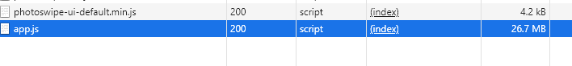
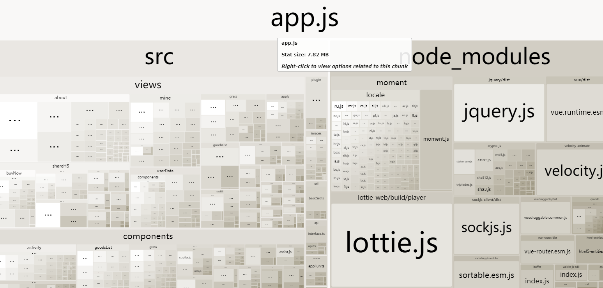

### 1. style-resoures-loader如何直接引入node_modules里面的文件

**业务背景**

自己把公用的sass抽离成了一个npm包,这样可以在每个项目里面方便的引入,可是在`vue.config.js`里面配置`style-resources-loader`的时候,只能通过相对路径引入,而无法直接引入`node_modules`下面的文件

下面的代码,去掉`node_modules/`,公共scss就无法正常引入

**示例代码**

```javascript
// vue.config.js
module.exports = {
  chainWebpack: (config) => {
    // 引入公共scss
    [
      'vue',
      'normal',
      'vue-modules',
      'normal-modules',
    ].forEach((type) => {
      const rule = config
        .module
        .rule('scss')
        .oneOf(type);
      rule
        .use('style-resource')
        .loader('style-resources-loader')
        .options({
          patterns: ['node_modules/rww-sass/_index.scss'],
        });
    });
    ...
```


### 2. [已解决]proxy代理404的问题(20200218)

**业务背景**

这个东西已经配置过N次了,但经常会出现404的问题,以前都是糊里糊涂的解决了,今天遇到了又去找了20多分钟,浪费时间,干脆花时间记下来,避免以后再搞


**示例代码**
```json
{"proxy": {
        "/apiUrl": {
          "target": "https://test-api-crm.xiujiadian.com/",
          "pathRewrite": {"^/api/": ""}
        },
        "/apisass": {
          "target": "https://test-api-saas.xiujiadian.com",
          "pathRewrite": {"^/apisass": ""}
        },
        "/apiGateWay": {
          "target": "https://test-gateway-api.xiujiadian.com/",
          "pathRewrite": {"^/apiGateWay/": ""}
        }
      }
      }
```

- 请求地址: /apiUrl/user/home
- 当前域名: localhost:443

**问题解决**
- 20200218
- target是想要代理到哪去,比如把localhost代理到baidu.com
- 最关键的是,不支持大小写,全部用小写
  - apiUrl改成apiurl
- 非常重要,无论前面是apiurl/user/home,还是/apiurl/user/home.pathRewrite的时候把`^/`加上
- 每次修改后,重新运行一下打包命令,以重启dev-server让刚刚的配置生效
- 参考: https://webpack.js.org/configuration/dev-server/#devserverproxy

```json
"proxy": {
        "/apiurl": {
          "target": "https://test-api-crm.xiujiadian.com/",
          "pathRewrite": {"^/apiurl/": ""}
        },
        "^/apisass": {
          "target": "https://test-api-saas.xiujiadian.com",
          "pathRewrite": {"^/apisass": ""}
        },
        "http": {
          "target": "https://test-gateway-api.xiujiadian.com/",
          "pathRewrite": {"^/http": ""}
        }
      }
```


###

### 3. [已解决]在vue.config.js里面如何设置eslint的fix为true(20200223)

**业务背景**

做uni-vant项目的时候,最开始未启用eslint,前两天把eslint加上,每个文件的换行符都报错,需要替换.但是家里的电脑和公司的电脑都报错,人工一个文件一个文件去修复简单是浪费生命,干脆直接改配置吧,可是chainwebpack配置一直是懵懵懂懂的 ,这次就必须把他搞明白了

**问题解决**
- 20200223
- 其实也挺简单的,就是参照文档介绍配置嘛
- 参考:
  - https://cli.vuejs.org/guide/webpack.html#modifying-options-of-a-loader

```
// vue.config.js
module.exports = {
  chainWebpack(webpackConfig) {
    webpackConfig
      .module
      .rule('eslint')
      .use('eslint-loader')
      .loader('eslint-loader')
      .tap((options) => {
        options.fix = true;
        return options;
      });
  },
};

```

### 3. 如何分析打包后的js文件内容(20200520)

**业务背景**

一直以来，webpack打包后的js

文件对我来说都是一个黑盒，完全不知道我的代码是怎么被放进去的。由于业务一直较多，没有时间来具体研究，这次换到集需购上班，一个电商项目开发环境打出来的js文件
居然有25M之多，必须得看一下了



但是通过`webpack-bundle-analyzer`看到的结果app.js却只有7M



