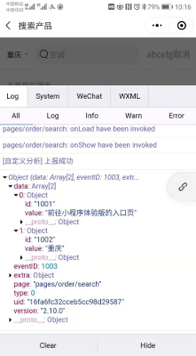

## 1 小程序后台 -> 统计 -> 自定义分析 -> 事件管理 -> 无法收集测试数据(20200115)

### 业务背景

利用小程序后台的数据分析功能,实现无侵入的自定义埋点功能

**操作步骤**

- 根据官方文档操作,新建自定义事件,填写配置
- 打开开发版/体验版小程序进行测试
- 在手机端的控制台看到 [自定义分析]上报成功
- 但是小程序后台(mp.weixin.qq.com)一直无法同步数据
  

\*_问题排除:_

- 应该不是配置错误,因为另外一个小程序配置了几十个埋点,都可以正常收集数据

### 示例代码

https://developers.weixin.qq.com/s/Id9Lgomm7qe4

## 2 小程序中常用的全局亦是(20201111)

### 业务背景

今天在看公司代码时,发现好几个地方有使用到小程序 jscore 本身的全局变量,有些亦是里面的属性还比较有用,所以可以专门收集下来,以便后面查看
最好是做成@types 文件,这样免得每次都来翻这个文档

- `__wxConfig`
- `global`
