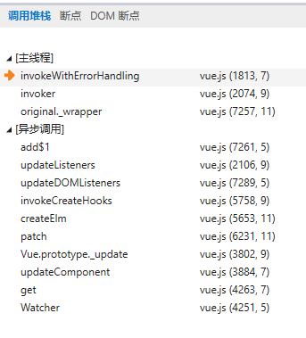
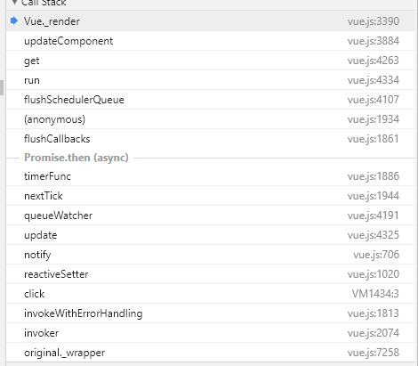
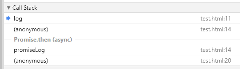

### 断点调试时,在开启`blockbox`后,会进入`VM***`的文件

### 在开发者工具里面,设置断点后,如何查看微任务和宏任务(20200510)

**业务背景**

最近在看vue源码,打着断点调试.发现在edge里面可以看到异步任务.这样一来整个代码执行流程就非常清楚了.



在chrome里面肯定也有类似功能




**问题**

但是所有的这些,都只能看到,已经执行的调用栈,对于那些未执行,即将执行的宏任务或微任务在哪里可以看呢?

下面的代码只能看到异步任务执行时的整个调用栈


我想要的是,在代码执行过程中,能够看到微任务队列里面有哪些函数,宏任务队列里面有哪些函数,可以办到吗?
```
<script>
  function log(x) {
    console.log(x);
  }
  function promiseLog(x) {
    Promise.resolve().then(() => log(x));
  }
  function timeoutLog(x) {
    setTimeout(() => log(x), 0);
  }
  log(1);
  promiseLog(2);
  timeoutLog(3);
  log(4);
  promiseLog(5);
  timeoutLog(6)
</script>
```
