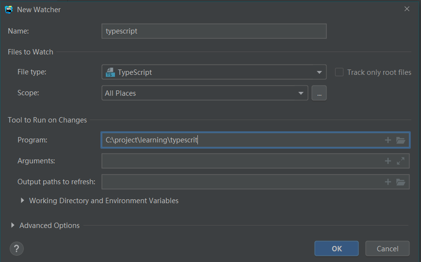

## 1. [已解决]报错: ESLint: TypeError: this.cliEngine is not a constructor(190825)

### 业务背景

更新了 package.json 里面的 elint 版本,重新下载了依赖包后,IDE 就报这个错

### 问题解决

升级`webstorm`到最新版本,或者把 eslint 降级到 5.x 版本

**原因分析**

就是 ide 和 eslint 版本不兼容导致的

## 2. [已解决]静态页面实时预览

### 业务背景

经常会单独开发两个单独的静态网页,改了东西还要手动去刷新,简单不要太麻烦,所以想要像`vue`那样改变内容后自动刷新的功能

但是我每次直接点编辑器

### 问题解决

IDE 自带了`live edit`功能,配合`debug`和`chorme`插件即可完成

具体的设置方法参考: https://www.jetbrains.com/help/webstorm/live-editing.html

**踩中的坑**

- `chomre`上安装了`JetBrains IDE Support`插件,但还是没效果
  - 点右键看看是否能够获取网页数据,不行的话重新安装就好了
- 点`debug`蜘蛛,打开的是一个空网页,根本用不了,而点编辑器右上角的浏览器图标,又没办法激活`chorme`插件
  - 先点绿色的三角形启动调试,再点红色的蜘蛛启动 debug,蛛蛛右上角出现绿点后就 ok 了

## 3. setting repository 无法同步 github 上的配置文件

### 业务背景

新电脑，新安装了`WebStorm 2019.2.1`版本，File -> settings reponsitory -> 粘贴 github 仓库地址 -> 填写 token -> overwrite local -> 右下角提示 settings successfully xynced

但实际上我的快捷键都没变

尝试了重装软件，重启电脑都无效。确定仓库上的快捷键是有效的。

之前也遇到过这个问题，但是不知道怎么的就出来了，所以就没做笔记，今天[2019-09-06]搞了一个多小时还是没出来。

## 4. vue 文件里面的 style,在格式化时不能自动排序规则顺序

### 业务背景

一直以来,都是手动调整 CSS 规则的属性,但是一些比较少用的属性顺序都是乱排的,比如动画,栅格的子属性及一些新的属性.自己去按照一些标准的规范把所有的顺序都记下来吧,也不现实,所以就利用 IDE 本身的`arrangement`自动格式化.这个确实很好用,在`HTML`和`CSS`文件都都能很好工作,但是在`VUE`里面就不生效了


## 5. [已解决]WebStorm 中 push 远程代码的时候,总是报权限错误(191108)

### 业务背景

通过`WebStorm`自带的 Git 工具 push 代码的时候,就总是报这个错,也不提供修改帐号密码的弹框,用命令行直接提交,就会提示输入帐号密码,但是输入后不会自动保存


### 问题解决

- 设置面板 -> Appearance && System Settings -> Password 关掉保存密码
- 关掉 IDE,重新进入
- 重新 Push,输入密码并且保存
- 然后再去设置面板打开即可
- 参考: https://stackoverflow.com/questions/28142361/change-remote-repository-credentials-authentication-on-intellij-idea-14

## 6. 代码格式化时,中文无法自动换行

### 业务背景

在系统自带的代码格式化配置的 HTML 里面设置了单行最大宽度,并且输入时会自动换行.但是中文里面无法生效,感觉这个问题和 css 里面的换行逻辑一样


## 7. [已解决]查看代码时,历史纪录切换的快捷键是啥(191118)

### 业务背景

在查看别人源码的时候,总是会一直不停的`ctrl + F12`追踪代码的执行步骤,但是代码层次稍微深一点的话,有时候想要返回查看刚刚查看的那几个方法,就比较麻烦了,要么是从头来,这样又要重复一次操作.要么是手动点开某个标签定位到代码位置,可是别人的代码是不熟悉的,这样操作也是有难度.o
记得有一个快捷键,可以像浏览器的历史纪录那样,前进后退,可以完美解决这个问题

### 问题解决

- 这个在 WebStorm 里面叫做最近定位纪录
- 可能通过`ctrl + shift + e`查看所有最近定位过光标的纪录,类似于查看浏览器的所有历史纪录
- 或者通过`ctrl + alt + <-/->`来快速切换,类似于浏览器里面的前进/后退
- [参考]
  (https://www.jetbrains.com/help/webstorm/2019.2/navigating-through-the-source-code.html)

## 8. [已解决]支持`flow`语法检查(191119)

### 业务背景

最近开始学习`vue`源码,它使用的是`flow`类型检查,老是报错,好烦~~插件里面搜索了一下 flow,也没相关的可用插件


### 问题解决

- Settings -> Languages & Frameworks -> version -> flow
- 保存即可
- [参考](https://blog.jetbrains.com/webstorm/2016/11/using-flow-in-webstorm/)

## 9. .vue 文件里面在 HTML 节点上使用$event 有警告(191121)

### 业务背景

在 vue 的子组件里面触发父组件的一个事件,为了省代码,以便后期阅读,所以直接写在了 HTML 里面,可是这样的话`$event`变量会报警告,想着去 inspections 里面把这条规则关掉,但是官方推荐添加框架的全局变量,看了一下,要自己写\*.ts 类型声明文件,留着以后再搞吧


## 10. [已解决]npm scripts tool 不见了(191126)

### 业务背景

最开始运行 npm 命令是打开一个 git 窗口,在里面手动输入命令,后来切换到 IDE 内部打开 terminal 面板手`动输入命令,最近要联调 uni-app 的网页+各种小程序,所以用上了内置的 scripts tool,点几下就行了,不用打开几个 terminal 窗口输入几次命令,可是前几天在调整 IDE 界面的时候,不知道咋的就把它搞不见了

在设置里面找了好久找到设置的地方

### 问题解决

- 打开 package.json 文件
- 点右键 -> show npm scripts

## 11. [已解决]在 sass 变量/混合的智能提示里面显示对应的注释(191128)

### 业务背景

自定义了 sass 公共库,所有项目都引用这个公共库,但是有好多变量记不住具体是什么意思,并且是什么值,特别是字号和间距那几个变量.每次写的时候都要跳到对应的 sass 页面看看,我要 14 号大小的字体,应该用哪个变量.再回来写,相当麻烦.就想着在智能提示的时候,能不能把值或者对应的注释顺便给显示出来,就不用我去跳页面了

\_size.scss

```sass
// 内容小板块间距 10
$section-xs: px2vw(10);
// 特殊版块和标题版块间距 12
$section-sm: px2vw(12);
// 主容器水平方向padding
$section-md: px2vw(16);
// 内容大板块间距 24
$section-lg: 24;
```

### 问题解决

- 自动打开
  - settings -> code -> general -> code completion
  - 选中`show the documentation popup in 1000 ms
  - 把时间改成 100


- 手动打开
  - 输入变量`$sec`,智能提示就会出来
  - 按下`ctrl + q` 和 `ctrl + shift + i`即可打开注释和定义窗口

## 12. [已解决]快捷键切换工作区组(191128)

### 业务背景

开发的时候经常是分成 2 屏甚至是 3 屏同时操作,一边显示 HTML,一边显示 JS,一边显示 CSS,这样搞起来快,在同一个工作组里面可以通过快捷键快速切换 editor,但是不同的组之间,现在还是通过鼠标来点.写代码的时候,写着写着,要去碰一下鼠标,是真心有点烦.

### 问题解决

- settings -> keymap -> main menu -> window -> editor tabs
- 找到`go to next/previous spliter`
- 设置相应的快捷键即可

## 13. [已解决]如何给 webstorm 添加全局变量(20200108)

### 业务背景

昨天开始写给`.vue`组件写单元测试,新建了`*.spec.js`文件,里面使用 describe 和 it 等关键词的时候都会有黄色的警告,原因是无法识别这种全局变量.感觉这个和第 9 个问题是一模一样的


### 问题解决

- 安装一个第三方库到 WebStorm 里面,然后设置为全局有效就行了
- Settings -> Language & Frameworks -> JavaScript -> Libraries -> Download -> 选择 jest 就行
- 参考
  - https://www.jetbrains.com/help/webstorm/configuring-javascript-libraries.html?q=webpack%20alias

## 14. [已解决]如何关联 webpack 别名@(20200108)

### 业务背景

使用 vue-cli3/4 生成的项目,因为通过服务端插件把 webpack 配置给隐藏到底层了,所以 WebStorm 无法识别 webpack 里面的别名.有时候写相对路径又太长了,看着不爽,但是换成别名`@`后,又会有波浪线提示,并且无法快速跳转到对应的文件里面


### 问题解决

- 还是和 vue-cli2 一样,得自己在根目录下面再单独配置一个 webpack 配置文件,一般重启 IDE 就好了
- 如果不生效,就手动然后把把 webpack 设置指向这个文件就行了
- 参考
  - https://www.jetbrains.com/help/webstorm/using-webpack.html

```
// webpack.config.js配置
const path = require('path');
module.exports = {
  resolve: {
    alias: {
      '@': path.resolve(__dirname, 'src/'),
    },
  },
};
```

## 15. [已解决]vue 项目里面如何识别从 node_modules 里面引入的 sass 变量混合等(20200112)

### 业务背景

开发项目时,有一套公共的 sass 变量混合和方法,每个项目都会在 webpack 里面配置集中引入.以前是把这些 sass 文件放到 src/assets/sass 下面,全部通过\_index.scss 导出.然后在 vue.config.js 里面配置引入.

后来觉得麻烦,就把 sass 抽离成一个单独的 npm 包,单独维护和引入,可是通过 node_modules 引入后,在 style 标签里面使用变量混合等就会有警告出现,而且无法自动跳转到变量定义的地方,这样对于强迫症患者来说,实在是难以忍受啊

**配置代码**

```
// vue.config.js
module.exports = {
  chainWebpack: (config) => {
    // 引入公共scss
    [
      'vue',
      'normal',
      'vue-modules',
      'normal-modules',
    ].forEach((type) => {
      const rule = config
        .module
        .rule('scss')
        .oneOf(type);
      rule
        .use('style-resource')
        .loader('style-resources-loader')
        .options({
          patterns: ['node_modules/rww-sass/_index.scss'],
          // 如果找成下面这种,在项目文件里就不会警告了
          patterns: ['./src/assets/sass/rww-sass/_index.scss'],
        });
    });
```

**错误截屏**


### 问题解决

- 打开 node_modules 文件夹
- 定位到 rww-sass 目录
- 点右键 -> mark directory as -> exclude
- 这样 ide 会自动索引文件，之后就可以点击跳转了，但是警告还是会有
- 实在受不了了,干脆把 sass 相关的 Inspection 全部禁用掉
  - 只是这样的话,就怕有时候手误,导致 bug 更麻烦

## 16. [已解决]越狱(20200116)

### 业务背景

最近封得很严啊,真想买个正版的了,可实在差钱用啊,所以还是想想法子

### 问题解决

- 20200116
- help -> Edit Custom VM Options
- 粘贴 `-javaagent:D:/jetbrains-agent/jetbrains-agent.jar`到最后一行
  - 已经拷贝到当前目录`jetbrains-agent.rar`
- 详细参考: https://zhile.io/2018/08/25/jetbrains-license-server-crack.html

## 17. [已解决]file watcher 一直报错(20200516)

### 业务背景

今天开始根据视频来学 typescript,其中有一个环节是通过 IDE 的 watcher 来实现实时的编译 ts 到 js.但是一直报下面这个错误

```
Failed to run File Watcher 'typescript'.
			The watcher has been disabled.
			Error: Cannot run program "C:\project\learning\typescrit" (in directory "C:\project\learning\typescrit"): CreateProcess error=5, 拒绝访问。
```

以前在写啄木鸟官网的时候,写 scss 时,也遇到这样的问题,最后不了了之,今天想搞定,但最搜了很久,还是木有解决,先纪录一个吧

感觉是和权限有关

- 用管理员身份运行 ide 无用
- 把项目从 c 盘移到 f 盘也木有用
- 甚至是重装了都不行

### 问题解决

- 20200516
- 原来是配置问题,我擦,还是应该认认真真,他他细细的看官方文档
- ts 不用配置,是自动转换成 js 的,就在当前目文件下面折叠起来的
  - language && frameworks -> typescript -> recompile on changes 勾选
  - 参考: https://www.jetbrains.com/help/webstorm/typescript-support.html
- sass 还是要配置一下,没有默认转
  - 首先是要全局安装 sass
  - 其实是新增一个 file watcher
  - 参考: https://www.jetbrains.com/help/webstorm/transpiling-sass-less-and-scss-to-css.html

之前的错误配置

- 那个 program 是编译程序的意思
- 我一直以为是项目地址
- 所以肯定会报无法执行的错误嘛..



sass 正确配置


## 18. 破解 markdown navigator(20201008)

### 业务背景

webstorm 官方提供的 markdown 插件相比与这个收费插件,简直是处于原始社会,我的个人博客也是通过 webstorm 编辑上传到 github 上面,所以又必须依赖于 webstorm 的插件.就一个插件还得收费,着实有点舍不得呀.

搜索了一下,感觉有点小麻烦呀.充值又太贵 10 刀一年啊.又不是天天用

还是先回退到官方提供的插件用着吧先

## 19. [已解决]macos 中如何设置打开项目的根目录(20201111)

### 业务背景

每次打开新的项目,默认是定位在 User/ranwawa 目录下面的,但是我的项目是放在 Documents/project
目录下面的,每次都得手动点过去,还是比较麻烦的,要自动定位到项目目录就 ok

### 问题解决

- 20201111
- setting -> Appearance & Behavior -> 直接点击 System Setting -> default project
  directory

## 20. [已解决]如何把图片粘贴到 webstorm 里面(20201111)

### 业务背景

之前在 Windows 里面的 WebStorm 中编辑 MarkDown 文件,下载一个插件后,可以直接`ctrl+v`把图片给粘贴到 MarkDown 中
但是在苹果里面来了,就只能粘贴图片的文件名....

### 问题解决

- 20201112
- 使用飞书等第 3 方截屏工具
- 昨天在截图的时候是用的 macos 自带的截图快捷键,保存图片后再去目录里面 copy 的.所以失败
- 刚刚用飞书的截屏,可正常工作,所以根本问题还是出现在 mac 使用上

**根本解决**

- 在 mac 截屏成功后
- 右下角会弹出一个图片,点右键存储到剪贴板即可

## 21. 如何识别微信小程序的 wxml 文件里面的相关语法

### 业务背景

好久木有在 webstorm 里面直接写 wxml 文件了,一打开,微信想着的语法全部飘红,应该有类似的插件专门来识别微信小程序的语法,空了来找一找

报错图如下

