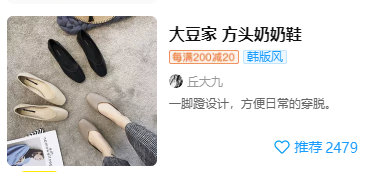

### 简述

什么是bem
- bem是一种基于组件形式的代码组织方式
- 以css为例
  - 一个css类名包含block,element,modifier3个部分

为什么要用bem
- 结构清晰,一目了然,易于复用
- 避免使用层级选择器,提升渲染性能

官网
- https://en.bem.info/methodology/quick-start/

### 用法

block
- 一个独立的组件可以用一个块来表示
- 块不能包含margin,position等影响外部节点的样式
- 命名
  - 以公司或项目开头
  - 加一个中划线`-`
  - 跟一个组件名
  - 比如一个商品块可以命名为`jxg-product`

```html
<!-- 错误的用法 -->
<!-- 没有以项目,公司命名开头 -->
<div class="product"></div>
<!-- 没有以中划线进行划分 -->
<div class="jxg_product"></div>

<!-- 正确的用法 -->
<div class="jxg-product"></div>
```

element
- 是block的后代,只能放在block里面使用
- 命名
  - 以block名开头
  - 跟两个下划线`__`
  - 跟上节点名
  - 比如商品图片可以命名为`jxg-product__image`

```html
<!-- 错误的用法 -->
<!-- 没有以双下划线区分 -->
<div class="jxg-product">
  <div class="jxg-product-image"></div>
</div>

<!-- 没有放在block里面 -->
<div class="jxg-product"></div>
<div class="jxg-product__image"></div>

<!-- 正确的用法 -->
<div class="jxg-product">
  <div class="jxg-product__image"></div>
</div>
```

modifier
- 是block或element的状态,比如颜色,尺寸
- 必须和block/element一起使用
- 命名
  - 以block/element开头
  - 跟一个下划线`_`
  - 跟上状态名`active`
  - 比如一个点击状态商品`jxg-product_active`
  - 比如一个红色的商标标签`jxg-product__tag_theme_red`

```html
<!-- 错误的用法 -->
<!-- 没有和块一起使用 -->
<div class="jxg-product_active">
  <!-- 没有用下划线分割 -->
  <div class="jxg-product__tag jxg-product__tag-theme_red"></div>
</div>

<!-- 正确的用法 -->
<div class="jxg-product jxg-product_active">
  <div class="jxg-product__tag jxg-product__tag_theme_red"></div>
</div>
```

### 示例

css示例

以一个商品展示为例


```html
<!-- 商品块(block) -->
<div class="jxg-product">
  <!-- 商品图片(element) -->
  
  <!-- 商品描述(element) -->
  <div class="jxg-product__desc">
    <!-- 商品标题(element) -->
    <div class="jxg-product__title"></div>
    <!-- 商品标签列表(element) -->
    <div class="jxg-product__tags">
      <!-- 商品标签(element)-->
      <!-- 商品标签颜色(modifier) -->
      <div class="jxg-product__tag jxg-product__tag_theme_red"></div>
      <div class="jxg-product__tag jxg-product__tag_theme_green"></div>
    </div>
    <!-- 商品里的店铺信息(element) -->
    <div class="jxg-product__shop">
      <!-- 店铺信息(block) -->
      <div class="jxg-shop">
        <!-- 头像(element) -->
        <div class="jxg-shop__avatar"></div>
        <!-- 昵称(element) -->
        <div class="jxg-shop__name"></div>
      </div>
    </div>
    <!-- 商品简介(element) -->
    <div class="jxg-product__intro"></div>
  </div>
</div>

<!-- 商品块(block) -->
<!-- 商品点击态(modifier) -->
<div class="jxg-product jxg-product_active"></div>
```
