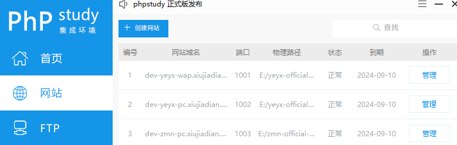

- 工作区的作用是什么
  - 把`DevTools`里面的修改直接保存到源文件里面
  - 网页刷新后不会消失
  
- 工作区存在的问题
  - 对`react` `vue`等单页应用的支持不太理想
  
- 工作区和本地重写的区别
  - 本地重写是暂时把修改保存到缓存里面,刷新网页后会失效
  
- 如何绑定网页和本地文件
  - 通过小皮启一个本地服务器并访问网页, 参考: https://www.xp.cn/
  - 打开调试面板并定位到`Sources`面板的`FileSystem`子面板
  - 添加当前网站目录
  - 点击允许浏览器访问/修改本地资源
  - 文件名旁边出现绿点说明绑定成功
  

 
- 如何保存CSS到硬盘
  - 直接修改`Element`面板里`Styles`子面板的CSS信息
  - 修改结果会自动同步到本地文件

- 如何保存HTML到硬盘
  - 修改`Sources`面板`Pages`子面板里面对应的HTML文件
  - 或者直接`ctrl + shift + p`呼出`Quick source`在当前面板快速打开当前对应的HTML
  
- 为什么不能在`Element`面板里面直接修改HTML了
  - 因为`Element`显示的是DOM节点
  - 而DOM节点是经过JavaScript和CSS加工后生成的
  - 即DOM节点并不是HTML源文件

- 如何保存JavaScript到硬盘
  - 修改JavaScript就和IDE里面差不多了
  - 就是把DevTools当成了一个IDE
  - 通过`ctrl + p`可以选择要打开的文件,修改保存即可

