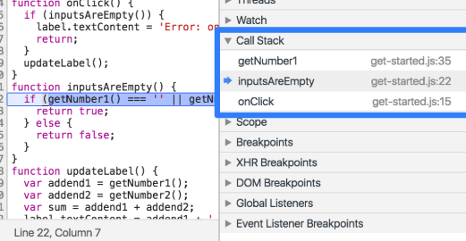

## 9.1 Get Started
In short, breakpoints can help you find and fix bugs faster than the *console.log()* method
  - 也就是说,以后在代码调试的时候,尽量别用console.log了,把习惯改过来
  
## 9.2 Pause Your Code With Breakpoints
- When to use each type of breakpoint type

|Breakpoint Type|Use this when you want to pause|
|-|-|
|Line-of-code|On an exact region of code|
|Conditional Line-of-code|On an exact of code, but only when some other condition is true|
|DOM|On the code that changes or removes a specific DOM node, or its children|
|XHR|When an XHR URL contains a string pattern|
|Event Listener|On the code that runs after an event, such as *click* is fired|
|Exception|On the line of code that is throwing a caught or uncaught exception|
|Function|Whenever a specific function is called|

- Line-of-code/Conditional Line-of-code breakpoints
  - Open the *source* panel
  - Open the file containing the line of code you want to break on
  - Go the line of code
  - Right click the line number column
    - Select *Add Breakpoint* -> blue icon 
    - Select *Add Conditional breakpoint* ->orange icon
- Manage Line-of-code breakpoints
  - Click the breakpoints pane
  - Right-click anywhere in the breakpoints pane
- DOM change breakpoints
  - Open *Elements* tab
  - Go the element that you want to set breakpoint on
  - Right-click the element
  - Hover over the *break on* and then select one of the options
    - Subtree modifications
    - Attributes modifications
    - Node removal
- XHR/Fetch breakpoints
  - Open the *Sources* panel
  - Click the *XHR breakpoints* pane
  - Click *Add breakpoint*
  - Enter the string which you want to break on
  - Press *Enter* to confirm
- Event listener breakpoints
  - Click the *Event listener breakpoints* pane
  - Check one of these categories, or expand the category and check a specific event.
- Exception breakpoints
  - Click *pause on exception*
  - Check the *pause on caught exceptions* checkbox if you also want to pause on caught exceptions
- Function breakpoints
  - Call *debug(functionName)*
  - You can insert *debug()* into your code or call it from DevTools Console
  
## 9.3 Find Unused JavaScript
find is easy, refactor is busy.
参考css相关笔记:https://juejin.im/post/5d76f8456fb9a06ad4516d73

> 好吧,距离上面这一段话不知道过去多少天了,今天是191029,今天继续笔记的时候,发现对查找未使用的代码详细的步骤已经不是太清楚了,还是再重复记录一次吧.一是强化记忆,二是练一练英文能力.

- What does the Coverage Tab do?
  - The Coverage Tab in Chrome Devtools can help you find unused JavaScript and CSS code
  
- Why does need to find unused code?
  - The extra code slows down your page load.

- How to find unused code  
  - Open the Coverage Tab?
    - `ctrl + shift + p`, Open the Command Menu
    - Type *coverage*
    - Select the *Show Coverage* command
  - Record code coverage
    - Click the button between *Instrument Coverage* and *Start Instrument Coverage and reload page*
    - Click *Stop Instrumenting record and show results* when you want to stop recording code coverage
  - Analyze code coverage
    - URL
    - Type
    - Total Bytes
    - Unused Bytes
    - unnamed column
      - The red section of the bar is unused bytes
      - The green section of the bar is used bytes
      
## 9.4 Map Preprocessed Code To Source Code
- What is a preprocessor?
  - A preprocessor takes an arbitrary source file and converts it into something that the browser understand.
  - With CSS as output, notable examples are: sass ...
  - With JavaScript as output, notable examples are: typescript ...
- What are Source Maps?
  - A source map is a JSON-based mapping format file
  - That creates a relationship between a minified file and it's sources.
- How Source Maps work?
  - It produces for each file
  - A preprocessor generates a source map file `.map` in addition to the compiled file
  - Each compiled file contains an annotation that specifies the URL of it's source map file

*source file `test.sass`*
```sass
$bg: 18px;
div { font-size: $bg;}
```
*compiled file `test.css`*
```css
div {font-size: 18px;}
/*# sourceMappingURL=test.css.map */
```
*source map `.map`*
```
{
  "version": "3",
  "mappings": "...",
  "sources": "[path/test.sass]",
  "file": "test.css"
}
```

- Other preprocessors
  - Transpiler: Babel
  - Compiler: TypeScript
  - Minifier: UglifyJS
  
- How to enable source maps in settings
  - `ctrl + shift + p`, type settings
  - Select *settings settings*
  - Switch to *preference sources*
  - Check *Enable JavaScript Source Maps* checkbox

- Where are Source Maps showed?
  - In the console
  - Step through code  
  
## 9.5 JS Debugging Reference
哎呀,不用英文记笔记了.我这个水平,读都还比较困难的时候,就写,确实有点操之过急了.还是先用中文记,快速的把技术知识掌握了才是当下最重要的事情.文档还是看英文的,写的能力等来年换工作后再做打算吧.现在是各种基础技术的积累.

### 9.5.1 单步调试
- 跳过函数
- 进入函数
- 跳出函数
- 逐步执行
- 执行到下一个断点
- 执行到指定行
  - 在代码行号处点击右键选择
  - 这个还是方便,经常在调试的时候会进入到第3方框架的压缩后的代码里面半天出不来.有了这个就可以直接跳到自己想要去的地方了
  

- 跳转到当前方法调用栈最开始的那个方法
  - 在`Call Stack`面板里面点击右键选择
  - 感觉这个没多大用啊...
  

- 跳过所有断点
  - 长按,选择
- 更改上下文环境
  - 在使用`webwork`时用到的,不过目前没用到过这个技术
  - 在`Thread`面板选择
  


### 9.5.2 scope作用域面板
- 查看修改变量
  - 全局的Global
  - 函数作用域里的Local
  - 闭包里面的Closure
  
  

### 9.5.3 Call Stack执行栈
- 会根据执行顺序把所有方法显示在这里
  - 单击方法可以查看源文件里面的内容
  - 点击右键可以复制堆栈信息,就可报错时打印出来的差不多,感觉这没多大用啊
  - 如果是异步方法,勾选上`Async`即可




### 9.5.4 不调试指定js
这个才是我最想要的功能,经常在调试代码的时候,就会进入一大串不知道是哪里来的压缩js,感觉永远也出不来了.现在终于可以直接忽视掉这些文件,只需要调试自己的业务逻辑代码即可.
- 3种指定不调试代码的方法
  - 在编辑框里点右键,选择`Blackbox Script`忽略整个文件
  - 在执行栈面板里面,右键选择`Blackbox Script`忽略当前方法
  - 在设置面板里面,通过正则忽略指定文件,选中*Blackbox content scripts*可以禁止调试扩展工具的js代码

### 9.5.5 watch监听面板  
- watch有什么用
  - 可以实时监听某一个表达式的值
  - 在调试一步代码操作后,就会自动更新值

- 如何监听
  - 在watch面板中,点右上角的加号即可
  
### 9.5.6 edit编辑器面板
格式化压缩代码
- 为什么要格式化压缩代码
  - 因为压缩后都在一行,肉眼无法看
  - 但即使格式化后,变量名这些也是压缩过的,还是看球不懂
  
- 怎么格式化压缩代码
  - editor编辑框里
  - 点左下角的大花括号即可
  
实时编辑代码
- 在修改一个js问题的时候,不用去IDE修改,然后刷新,直接在源代码的编辑框里修改,然后保存,DevTools会自动加载这个编辑后的代码,省去很多调试的事情

## 9.6 Snippets
- 什么是代码片段
  - 有点类似于IDE里面的代码片断
  - 可以保存很多自定义的小js方法
  - 在所有的网页上都可以快速的调用

- 为什么需要代码片段
  - 代码片段时永久保存在浏览器里面的
  - 要经常在控制台执行某个js方法时,就可以保存在这里
  - 避免每次都要输啊输啊输

- 代码片段的增删改查
  - 在`Sources`资源面板中的左上角,点更多可以出来
  - 在里面操作就行了,非常简单


## 9.7 Sources Panel Overview
## 9.8 Guides


