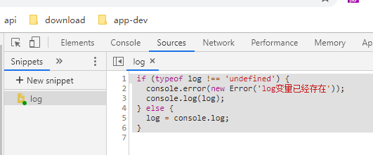

> 笔记结构相对于书上的结构做了一下调整,先整体介绍这两个关键字有什么特性,然后再用示例逐个解析这些特性,输出值不直接标出来,方便以后回顾,如果回顾的时候能够肉眼计算出输出值,说明原理是完全掌握了的

## 2.1 let
新的特性
- 块级作用域
- 暂时性死区 -> 无法变量提升
- 禁止重复声明
```
let a = 1;
```

## 2.2 const
新的特性
- 声明为常量,声明时必须赋值
- 其他和let一样
```
const a = 1;
```

## 2.3 新特性示例
> 先在浏览器保存一个代码片段`log`,是`console.log`的简写方式.方便后面输入例子时少打一些字.



### 2.3.1 块级作用域
```javascript
{
  let a = 10;
  var b = 1;
}
log(a, b); // => 
```
```javascript
for (let i = 0; i < 10; i++) {}
console.log(i); // =>
```
```javascript
var a = [];
for (var i = 0; i < 10;  i++) {
  a[i] = function() {
    log(i);
  }
} 
a[6](); // => 
```
```javascript
var a = [];
for (let i = 0; i < 10;  i++) {
  a[i] = function() {
    log(i);
  }
} 
a[6](); // => 
```
```javascript
for (let i = 0; i < 10;  i++) {
  let i = 'abc';
  log(i); // =>
} 
```
```javascript
var bar = 1;
function foo() {
  log(bar);
  {
    var bar = 2;
  }
}
foo(); // =>
```
```javascript
function foo() {
  let bar = 5;
  {
    let bar = 10;
  }
  log(bar);
}
foo(); // =>
```
```javascript
{{{
  {
    let bar = 5;
  }
  log(bar); // =>
}}}
```
```javascript
{{{
  let bar = 5;
  {
    log(bar); // =>
  }
}}}
```
```javascript
function foo() { console.log('I am outside!'); }
(function () {
  {
    function foo() { console.log('I am inside!'); }
  }
  foo();
}()); // =>
```
```javascript
function foo() { console.log('I am outside!'); }
(function () {
  function foo() { console.log('I am inside!'); }
  foo();
}()); // =>
```
### 2.3.2 变量提升
```javascript
log(foo); // =>
var foo = 2;
```
```javascript
log(foo); // =>
let foo = 2;
```

### 2.3.2 暂时性死区
- 什么是暂时性死区
  - temporal dead zone,简称TDZ
  - 代码块内,声明变量之前,都无法访问
```javascript
var foo = 1;
{
  log(typeof foo); // =>
  log(typeof foo2); // =>
  let foo = '1';
  log(typeof foo);
}
```
```javascript
foo = 1; // =>
let foo;
```
```javascript
let foo;
log(foo); // => 
foo = 2;
log(foo); // =>
```
```javascript
function bar (x = y, y = x) {
  log(x, y); 
}
bar(); // =>
```
```javascript
function bar (x = 2, y = x) {
  log(x, y); // =>
}
bar();
```

### 2.3.3 重复声明
```javascript
{
  let a = 1;
  var a = 2; // =>
}
```
```javascript
function foo (arg) {
  let arg;
}
foo() // =>
```
```javascript
function foo() {
  {
    let arg;
  }
}
foo(); // =>
````


### 2.3.4 常量
```javascript
const bar = 1;
bar = 2; // =>
```
```javascript
const bar;
bar = 2; // =>
```

### 2.3.5 全局变量
ES6亲规,let/const/import声明的全局变量,不是顶层对象的属性,避免全局污染
```
var a = 1;
let b = 2;
log(window.a, window.b); // =>
```