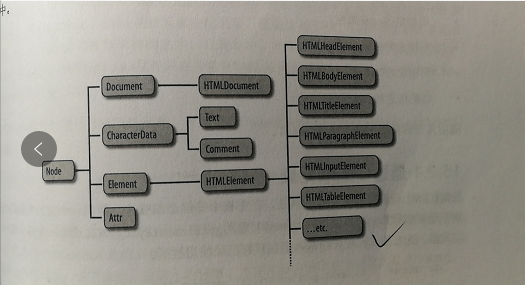

## 15.1 概述

什么是DOM
- document object model
- 文档对象模型
- 是表示和操作HTML和XML文档内容的基础API

什么是Node
- DOM树中的每一个节点
- 拥有很多属性和方法来操作HTML

Node的3个常用子类
- Document
  - DOM树的根节点,代表整个文档
- Element
  - DOM树中的元素节点
- Text
  - DOM树中的文本节点

Document和HTMLDocument,Element和HTMLElement的区别
- 前者可以是任意文档的根/元素节点
- 而后者只能是HTML文档的根/元节点




## 15.2 选择节点

### 15.2.1 通过ID选择
语法
- document.getElementById

2个注意项
- 区分大小写
- 低于IE8的兼容问题
  - 不区分大小写
  - 也会查找name属性

### 15.2.2 通过name选择

语法
- document.getElementsByName

2个注意项
- 定义在HTMLDocument中,所以只支持HTML文档
- 在IE中,也会查找id

4种支持name属性的元素
- form
- 表单元素
- img
- iframe

6种自动添加document属性名的属性
- form
- img
- iframe
- embed
- object
- applet(已经废弃)

注意
- iframe是例外
  - 正常情况下,document.test返回当前元素,或者所有元素的NodeList集合
  - iframe则返回的是该框架的Window对象

```


document.test === document.getElementsByName('test')[0];
```

### 15.2.3 通过tag选择

语法
- document.getElementsByTagName

什么是HTMLCollection
- HTMLDocument上用于快捷访问一些节点的属性,这些属性返回的结果即是HTMLCollection

6个可以返回HTMLCollection的属性
- document.images 返回 
- document.forms 返回 <form\>
- document.links 返回有href属性的<a\>
- document.embeds/document.plugins 返回 <embed\>
- document.anchors 返回有name属性的<a\>
- document.scripts 返回 <script\>

HTMLCollection和NodeList的特点
- 都是类数组
- 对象都是实时的
  - 文档结果发生变化,对象会跟着变化

### 15.2.4 通过CSS类选择

语法
- document.getElementsByClassName

为什么要用ClassName
- 因为class在js中是保留字
- 所以无法使用class,就用了ClassName

### 15.2.5 通过选择器选择

语法
- document.querySelectAll
- document.querySelect

2个与getElementXXX的区别
- 查找的结果是静态的
  - 而后者是实时的
- 在元素上调用时,指定的选择器先在整个文档中查找,然后过滤出该元素的后代
  - 而后者则只在当前元素后代里面查找

3个注意事项
- 无法应用在:first-line,:first-letter这样的伪元素上
- 无法应用在:link,:visited这样可能导致隐私泄露的属性上
- IE8及以下,只支持CSS2

替代方案
- Sizzle库
  - 是Jquery的CSS选择器库
  - https://github.com/jquery/sizzle/wiki

## 15.3 文档结构

节点树和元素树的区别
- 节点树即NODE节点,包含文本,注释节点
- 元素树仅仅是Element对象树,剔除了文本和注释节点

节点树的属性
- parentNode
- childNodes
- firstChild,lastChild
- nextSibling,previousSibling
- nodeType
  - 9 Document节点
  - 1 Element节点
  - 3 Text节点
  - 8 Comment节点
  - 11 DocumentFragment节点
- nodeValue 文本节点的内容
- nodeName

元素树的属性
- firstElementChild, lastElementChild
- nextElementSibling, previousElementSibling
- childElementCount
- 可通过类型判断,实现元素节点的相关父子元素属性

## 15.4 操作属性

attributes和property的区别
- attributes一般应用在HTML上,指HTML的属性attributes
- property一般应用在js上,指HTMLElement对象的属性property

### 15.4.1 基于属性的API

语法
- document.forms[0].action
- document.getElementById('test').dataset.test

3个注意事项
- HTML属性不区分大小写,但是JavaScript区分
  - 转换到js时应全部小写, 如 ID -> id
  - 如果有多个单词,则要换成驼峰,如 tabindex -> tabIndex
- 有些HTML属性是JavaScript的保留字
  - 一般情况是加html前缀,如 for -> htmlFor
  - class是例外,class -> className
- HTML属性的值一般是字符串
  - 如class="test"
  - 但数值和布尔型的,会自动转换成对应类型,如maxlength="5" -> 5
  - style属性会转换成CSSStyleDeclaration对象

缺陷
- 只能查找,设置标准的HTML属性
  - 无法操作自定义的属性
- 无法删除属性

```
document.getElementById('ranwawa').style.__proto__.constructor.name === 'style属性会转换成CSSStyleDeclaration'
```

### 15.4.2 方法操作

4个常用的方法
- getAttribute('class')
- setAttribute('class', 'test')
- hasAttribute()
- removeAttribute()

4个很少用的方法
- 分别在上面4个后面加上NS
- 和命名空间相关的,暂时跳过,好像现在没有应用场景

操作方法和属性API的区别
- 所有属性值都被看成字符串,包括style,disabled等
- 查找时,使用标准的属性名,包括class,data-set

### 15.4.3 数据集属性

为啥会出现数据集属性
- 有需求会在HTML结点上挂载一些数据,比如age,sex等
- 但添加多了就会耦合太高,又乱了
- 所以data-开头的专门用来挂载值

3个使用注意事项
- 通过dataset获取,
- 去掉data-
- 后面的连字符改成驼峰
```
<input name="test" data-test-attr="1" / >
document.getElementsByName('test')[0].dataset.testAttr // => 1
```

### 15.4.4 Attr节点属性

语法
- document.getElementById('ranwawa').attributes

返回的是一个Attr对象集合
- 一个Attr包含name,value两个属性
- 分别指代属性名属性值

```
<input name="test" data-test-attr="1" / >
document.getElementsByName('test')[0].attributes[0].value // => test
document.getElementsByName('test')[0].attributes.name.name // => name
```

## 15.5 操作内容

### 15.5.1 作为HTML的元素内容

语法
- innerHTML 当前元素的内容
- outerHTML 包含当前元素标记+innerHTML
- insertAdjacentHTML('beforbegin|afterbegin,beforend,afterend', value) 在元素的指定位置插入HTML

为啥要避免使用`+=`设置innerHTML
- 给innerHTML赋值时,会调用浏览器的渲染引擎,将字符串渲染成DOM节点挂载到页面上
- 频繁的+=又要序列化,又要解析,非常耗时,一般是赋值给一个str,拼接好了一次性赋值给innerHTML

### 15.5.2 作为纯文本的元素内容

语法
- textContent
- innerText
- 指定元素所有后代元素的Text节点串联在一起

两者的区别
- innerText会忽略`<script>`标签里的文本
- innerText也会忽略空白,保留制表符

### 15.5.3 作为Text节点的元素内容

语法
- nodeValue

这个就不记录了
就是获取节点,然后判断其nodeType是否为3,然后获取或者设置其nodeValue

## 15.6 操作节点

### 15.6.1 创建节点

5个方法
- document.createElement(tagName) 创建元素节点
- document.createTextNode() 创建文本节点
- document.createComment() 创建注释节点
- document.cloneNode() 复制节点
  - 默认复制当前节点
  - 传入true会递归复制子节点
- document.createDocumentFragment() 创建节点容器

### 15.6.2 插入节点

2个方法
- appendChild(node)
  - 在新节点的父元素上调用
  - 插入到最后
- insertBefore(node, node)
  - 第2个参数必须是调用节点的子节点
  - 第2个参数为null的话,就是插入到最后

注意
- 已经出现在文档中的节点,如果进行插入
- 会移出之前的节点,放到新的地方

### 15.6.3 删除替换节点

2个方法
- removeChild()
- replaceChild()

```javascript
// 自己实现outerHTML
(function() {
  if (document.createElement('div').outerHTML) { return; }
  
  function outerHTMLSetter(str) {
    var container = document.createElement('div');
    container.innerHTML = str;
    while (container.firstChild) {
      this.parentNode.appendChild(container.firstChild);
    }
    this.parentNode.removeChild(this);
  }
  function outerHTMLGetter() {
    var container = document.createElement('div');
    container.appendChild(this.cloneNode(true));
    return container.innerHTML;
  }
  if (Object.defineProperty) {
    Object.defineProperty(
      Element.prototype,
      'outerHTML',
      {
        get: outerHTMLGetter,
        set: outerHTMLSetter,
        enumerable: false,
        configurable: true,
      }
    )
  } else {
    Element.prototype.__defineGetter__('outerHTML', outerHTMLGetter);
    Element.prototype.__defineSetter__('outerHTML', outerHTMLSetter);
  }
}())

// 倒序节点
(function() {
  Element.prototype.reverse = function() {
    var f = document.createDocumentFragment();
    while (this.lastChild) {
      f.appendChild(this.lastChild);
    }
    this.appendChild(f);
  }
}())
```

## 15.7 几何形状与滚动

分清两个概念
- 抽象的 基于树的 文档对象模型
- 视觉的 基于坐标的 几何形状视图

### 15.7.1 坐标体系

2种坐标系
- 视口坐标: 即浏览器窗口坐标
- 文档坐标: 即HTML节点坐标

坐标方向
- x轴向右增加
- y轴向下增加

坐标转换
- 当文档内容超出视口大小后,两者就不相同了
- 需要通过滚动条的滚动位置来进行转换

滚动条偏移量

|属性名|适应浏览器||
|:-:|:-:|:-:|
|window.pageXOffset<br/>window.pageYOffset|IE8以下不支持|
|documentElement.scrollLeft<br/>documentElement.scrollTop|怪异模式不支持|优先使用|
|documentElement.body.scrollLeft<br/>documentElement.body.scrollTop|仅支持怪异模式|

视口尺寸

|属性名|适应浏览器||
|:-:|:-:|:-:|
|window.innerWidth<br/>window.innerHeight|IE8以下不支持|
|documentElement.clientWidth<br/>documentElement.clientHeight|怪异模式不支持|优先使用|
|documentElement.body.clientWidth<br/>documentElement.body.clientHeight|仅支持怪异模式|


### 15.7.2 元素尺寸

方法
- getBoundingClientRect()
  - left,top 左上角的坐标
  - right,bottom 右下角的坐标
- getClientRects()
  - 返回的是数组
  - 专门用于查询内容元素每一行独立的矩形

getBoundingClientRect()注意:
- 返回的是视口坐标
- 内联元素是返回的边界矩形
  - 即换行的内联元素是所有行加起来的完整矩形

### 15.7.3 滚动

方法
- 

|属性名|原理||
|:-:|:-:|:-:|
|设置属性值scrollLeft, scrollTop|设置偏移量|
|scroll(),scrollTo()两个是同样的意思|指定的点出现在视口的左上角|优先使用|
|scrollBy()|设置偏移量||
|scrollIntoView()|显示当前节点|类似于锚点效果<br />元素的上边尽量接近视口上边<br />如果传false,则是元素下边接近视口下边|

### 15.7.4 元素节点的尺寸属性

offset相关
- 获取的是文档坐标,即相对于HTML节点的坐标
- 定位元素则是相对于其父元素的坐标
- 如果offsetParent为null,则说明是取的文档坐标

|属性名|含义|
|:-:|:-:|
|offsetWidth|元素宽|
|offsetHeight|元素高|
|offsetLeft|左上角x坐标|
|offsetTop|左上角y坐标|
|offsetParent|坐标参考元素|

client相关
- width,height 只包含content + padding
  - offset则包含content + padding + border
- 行内元素的width,height 始终返回0
- left,top 相当于是 边框宽度

|属性名|含义|
|:-:|:-:|
|clientWidth|元素宽|
|clientHeight|元素高|
|clientLeft|左边框宽|
|clientTop|上边框宽|

scroll相关
- 有滚动条时, width height 相当于元素的实际大小

|属性名|含义|
|:-:|:-:|
|scrollWidth|x宽|
|scrollHeight|y高|
|scrollLeft|x偏移量|
|scrollTop|y偏移量|
//jsrun.pro/tyfKp/embed/all/light/

## 15.8 其他接口

### 15.8.1 获取选中文本

方法
- window.getSelection() IE无法使用
  - toString() 返回选中值
  - 无法选中输入框中的值
- document.selection.createRang() IE专用
  - text属性返回选中值
  - 可识别输入框中的信息

标准浏览器中,识别输入框中的选中值
- document.form.input1.selectionStart 选中的起点
- ...selectionEnd
- 利用字符串截取即  ....value.substring(.selectionStart, .selectionEnd);j

### 15.8.2 可编辑的内容

启用任意元素的编辑功能,有很多属性和方法,自己实现的富文本的必要性比较低.记个接口名字即可

HTML属性
- contenteditable 启用编辑功能
- spellcheck 启用语法检查功能

DOM属性方法
- designMode 整个文档可编辑,一般用于iframe
- execCommand() 执行相关命令,比如加粗,斜体等
- queryCommandSupport() 查询接口是否支持,一般是用之前做兼容处理