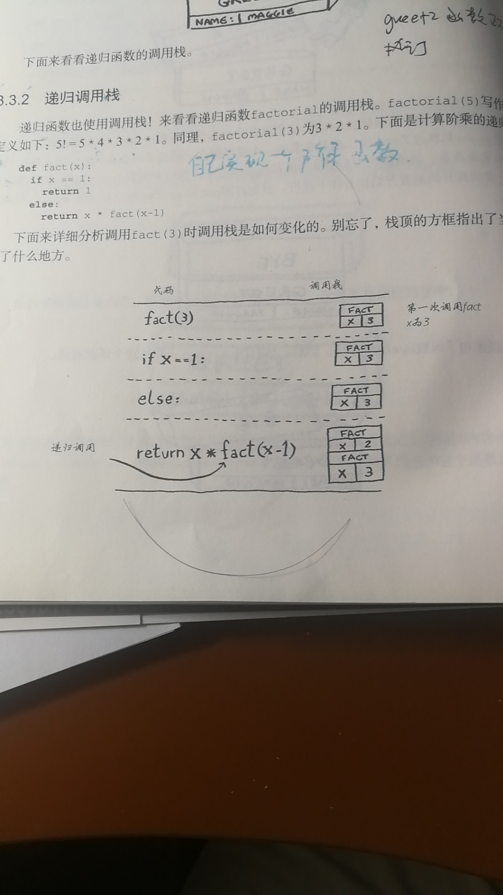
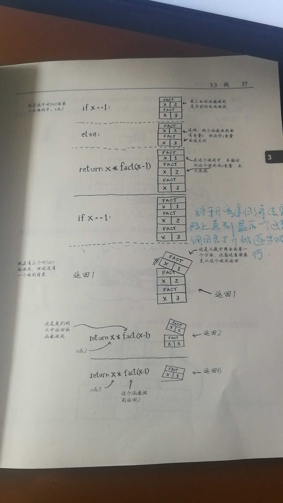

## 3.1 递归

什么是递归
- 函数自己调用自己

递归的2个重要概念
- 递归条件: 什么条件下要调用自己
- 终止条件: 啥时候结束递归

## 3.2 调用栈

什么是栈
- 后进先出的数据结构

栈的2个重要操作
- 压入
- 弹出

什么是函数调用栈
- 函数里面嵌套函数时
- 执行内层函数时,会一直保存上层函数的变量信息
- 当前函数执行完才会释放当前函数占用的内存




## 3.3 递归调用栈

递归调用栈的特点
- 不同函数作用域之间的实参是无法共享的
- 栈太高的话,容易导致内存溢出

如何解决递归调用的内存占用高的问题
- 换成循环
- 使用尾递归

实现一个阶乖函数
```javascript
// 循环方式
function circle(num) {
  let result = 1;
  for(var i = 1; i <= num; i += 1) {
    result *= i;
  }
  console.log(result);
}

function recursion(num) {
  if (num === 1) {
    return num;
  } else {
    return num * recursion(num - 1);
  }
}

debugger;
console.log(circle(5));
console.log(recursion(5));
```
