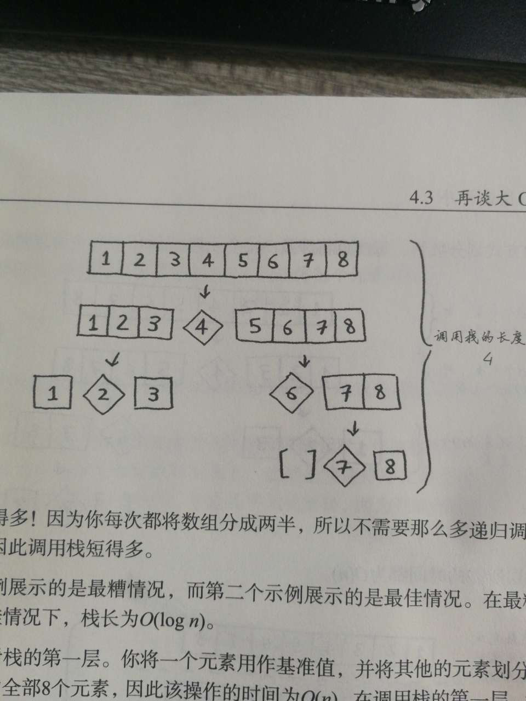

## 4.1 分而治之(递归)

递归求数组的和
```javascript
var arry = [5, 2, 3, 88];

function sum(arr) {
  if (arr.length === 1) {
    return arr[0];
  } else {
    return arr[0] + sum(arr.slice(1));
  }
}
```

递归求数组的个数
```javascript
var arry = [5, 2, 3, 88];

function count(arr) {
  if (arr.length === 1) {
    return 1;
  } else {
    return 1 + count(arr.slice(1));
  }
}
```

递归找出数组最大的数
```javascript
var arry = [5, 2, 3, 88];

function max(arr) {
  if (arr.length === 2) {
    return arr[0] > arr[1] ? arr[0] : arr[1];
  } else {
    var temp = max(arr.slice(1));
    return arr[0] > temp ? arr[0] : temp;
  }
}
```

## 4.2 归纳证明(快速排序)

自己实现一个快排
```javascript
var arry = [8, 9, 2, 3, 11, 1, 2, 3, 4, 5, 6, 6];

function qSort(arr) {
  var length = arr.length;
  if (length <= 1) {
    return arr;
  } else {
    var pivotIndex = (length / 2) - (length / 2 % 1) - 1;
    var pivot = arr[pivotIndex];
    var smaller = [];
    var larger = [];
    var pivotArr = [];
    var temp;
    for (var i = 0; i < length; i += 1) {
       temp = arr[i];
       if (pivot === temp) {
         pivotArr.push(temp);
       } else if (temp <= pivot) {
         smaller.push(temp);
       } else {
         larger.push(temp);
       }
    }
    return qSort(smaller).concat([pivot]).concat(qSort(larger));
  }
}
console.log(qSort(arry));
```


todo 这个真的傻傻无法分辨清楚

归纳证明和分而治之的区别
- 归纳证明
  - 是要找出一条规律,适应其他情况
- 分而治之
  - 是要把大问题分解成一样的小问题(感觉和找出一条规律是一样的嘛)
## 4.3 再谈大O表示法

常量的影响
- 遍历查找和二分查找
  - 数据规模大时影响巨大
  - 可以忽略常量
- 快速排序和归并排序
  - 常量对速度影响比较大
  - 同样时nlog(n),但是快排的常量要比合并排序的小
  - 所以无法忽略常量

快速排序
- 平均情况
  - 尽量取中间值
  - 每一层循环n次
  - 有log(n)层
  - 所以是n*log(n)
- 最坏情况
  - 每次都取第1个或最后一个
  - 每一层循环n次
  - 有n层
  - 就是n2



