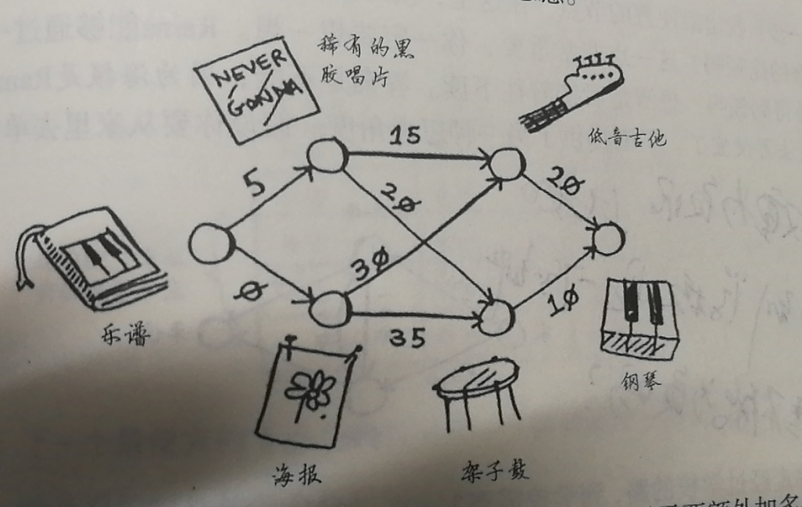

## 7.1 算法简介

什么是狄克斯特拉算法
- 找出图中起点到终点`权重`最低的算法

狄克斯特拉算法和广度优先搜索算法之间的区别
- 狄克斯
  - 找出权重最低的路径
  - 路径经过的边可能不是最少的那一条
- 广度优先搜索
  - 找出两点之间经过的最短路径,即经过的边必须最少
  - 不需要考虑权限

狄克斯特拉算法的适用场景
- 有向无环图
- 无法处理负权边
  - 可以用贝尔曼福德算法

狄克斯的解题思路
- 找出最便宜的节点
  - 即从前点开始,权重之和最低的节点
- 找出经该节点到所有邻居的开销,如果开销更低,则更新
  - 开销即起点到当前节点的权重之和
- 重复这个过程,更新每一个节点的最低开销
- 计算最终路径

## 7.2 实现



```javascript
// origin先用一个hash表来存这个图
// costs再用一个hash存所有节点的开销
// parents再用一个数组来存父节点
// processed再用一个hash来存已经处理过的节点

// 初始化costs
// 找出开销最低的节点
// 更新父节点
// 找出邻居节点的开销,更新costs
// 循环操作

var origin = {
  music: {
    disc: 5,
    post: 0,
  },
  disc: {
    guitar: 15,
    drum: 20,
  },
  post: {
    guitar: 30,
    drum: 35,
  },
  guitar: {
    piano: 20,
  },
  drum: {
    piano: 10,
  }
};
var costs = {};
var parent = {};
var processed = {};

function findSlowestNode() {
  var time = Number.POSITIVE_INFINITY;
  var nodeKey;
  Object.keys(costs).forEach(key => {
    console.log(`${key}节点,${!processed[key] ? '未' : '已'}处理,开销是${costs[key]}`);
    if(!processed[key] && costs[key] < time) {
      nodeKey = key;
      time = costs[key];
    }
  });
  return nodeKey;
}

function updateNeighbor(end) {
  var nodeKey;
  var nodeTime;
  while ((nodeKey = findSlowestNode())) {
    // 更新邻居的开销
    nodeTime = costs[nodeKey];
    Object.entries(origin[nodeKey]).forEach(([key, value]) => {
      costs[key] = nodeTime + value;
      parent[key] = nodeKey;
    })
    // 标记已处理
    processed[nodeKey] = true;
  }
  console.log(costs[end]);
  console.log(findPath(end));
}
function findPath(nodeKey) {
  if((nodeKey = parent[nodeKey])) {
    return nodeKey + ' -> ' + findPath(nodeKey);
  } else {
    return '';
  }
}

function init (start, end) {
  debugger;
  costs[start] = 0;
  costs[end] = Number.POSITIVE_INFINITY;
  processed[end] = true;
  updateNeighbor(end);
}
init('music', 'piano');
```
