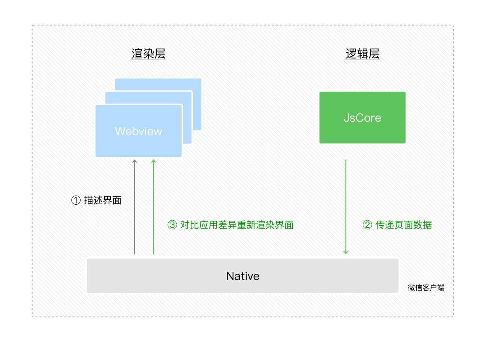

宿主环境是啥
- 简而言之,就是微信

## 3.1 渲染层和逻辑层

完整的通信模型

渲染层的工作
- 解析WXML字符串
 - 生成虚拟DOM
 - 将虚拟DOM发送给逻辑层
 - 接收逻辑层数据,并差量对比,生成/更新DOM
- 监听事件并通过逻辑层执行事件处理函数

逻辑层的工作
- 执行js逻辑,调用各种接口
- 将页面数据发送给渲染层,以完成页面数据绑定

native层的工作
- 负责接收渲染层/逻辑层的数据
  - 并将数据转发给对方
- 负责转发request请求

## 3.2 程序和页面

### 3.2.1 程序

App构造函数
- 在整个JSCore中是单例

生命周期
- onLaunch 冷启动
- onShow 热启动
- onHide
- onError

入参
- path
- query
- scene
- shareTicket
- referrerInfo相关

### 3.2.2 页面

Page构造函数
- 每个页面都有一个实例

生命周期
- onLoad
- onShow
- onReady
- onHide
- onUnLoad

入参
- 类似于URI的query部分

用户行为
- onPullDownRefresh
- onReachBottom
- onShareAppMessage
- onPageScroll

页面栈
- navigateTo 压入
- navigateBack 弹出
- redirectTo 替换栈尾数据
- switchTab 清空栈

注意页面栈和页面生命周期钩子的有关系
- https://developers.weixin.qq.com/ebook?action=get_post_info&docid=0004eec99acc808b00861a5bd5280a

## 3.3 组件
原生组件
- 即Image这些等

自定义组件
- https://developers.weixin.qq.com/miniprogram/dev/framework/custom-component/

## 3.4 API

api通用规则
- on开头的就是监听某个事件
- 正常情况下都是异步方法
  - async结尾的都是同步方法
  - 所有异步方法都接收success,fail,complite三个回调函数
- get开头的接口是获取宿主环境数据
- set开头的接口是设置宿主环境数据

## 3.5 事件

常见的冒泡事件
- 手势事件
  - touchstart
  - touchmove
  - touchend
  - touchcancel
- 手指事件
  - tap
  - longpress
  - longtap
- 动画事件
  - animationstart
  - animationiteration
  - animationend

绑定事件处理函数
- capture:tap 捕获阶段
- bind:tap 冒泡阶段
- capture-catch:tap 捕获阶段阻止事件传播
- bind-catch:tap 冒泡阶段阻止事件传播

## 3.6 兼容

处理兼容的2种方式
- wx.xxx是否有该api
- wx.canIUse
  - 可识别api
  - 也可识别组件
  - https://developers.weixin.qq.com/miniprogram/dev/api/base/wx.canIUse.html
